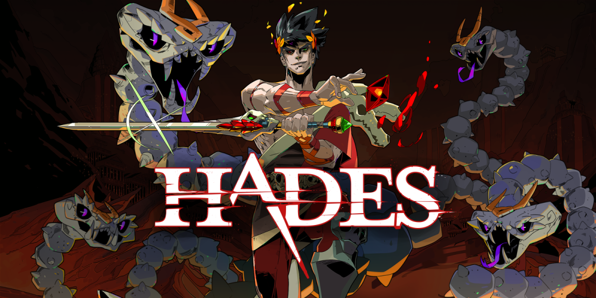

# **Hades**

## Descrição

O projeto atual é uma iniciativa que busca desenvolver um jogo baseado no renomado universo do jogo Hades. Este empreendimento é uma aplicação direta dos conceitos teóricos adquiridos na disciplina Sistema de Banco de Dados 1, ministrada pela FGA UnB. O objetivo é não apenas replicar a rica mitologia e a jogabilidade cativante que caracterizam Hades, mas também implementar técnicas sofisticadas de gerenciamento de banco de dados para otimizar o desempenho e a experiência do usuário. Este projeto representa um marco significativo em nosso percurso acadêmico, permitindo a integração da teoria e prática de maneira eficaz e impactante.

## Participantes

| Nome                                                               | Matrícula |
| :----------------------------------------------------------------- | :-------: |
| [Francisco Mizael Santos da Silva](https://www.github.com/frmiza)  | 180113321 |
| [Guilherme Basílio do Espirito Santo](github.com/GuilhermeBES)     | 160007615 |
| [Joao Lucas Pinto Vasconcelos](github.com/HacKairos)               | 190089601 |
| [Arthur josé Nascimento de Lima](https://github.com/Arthurlima544) | 190084600 |

## Apresentações

| Módulo | Link da gravação          | Data       |
| ------ | ------------------------- | ---------- |
| 1      | [Apresentação Módulo 1](docs/videos/VideoEntrega1SBD1.zip) | 30/09/2023 |
| 2      | [Apresentação Módulo 2](docs/videos/VideoEntrega2.mp4) | 30/10/2023 |
| 3      | [Apresentação Módulo 3](docs/videos/VideoEntrega3) | 04/12/2023 |

## Entregas

- Módulo 1
  - [Modelo Entidade-Relacionamento](https://sbd1.github.io/2023.2-Hades/Modulo-1/MER/)
  - [Diagrama Entidade-Relacionamento](https://sbd1.github.io/2023.2-Hades/Modulo-1/DER/)
  - [Modelo Relacional](https://sbd1.github.io/2023.2-Hades/Modulo-1/ModeloRelacional/)
  - [Dicionário de Dados](https://sbd1.github.io/2023.2-Hades/Modulo-1/Dicionario_Dados/)
  - [Normalização](https://sbd1.github.io/2023.2-Hades/Modulo-1/DFS/)
- Módulo 2
  - [DDL](https://sbd1.github.io/2023.2-Hades/Modulo-2/DDL/)
  - [DML](https://sbd1.github.io/2023.2-Hades/Modulo-2/DML/)
  - [DQL](https://sbd1.github.io/2023.2-Hades/Modulo-2/DQL/)
  - [Álgebra Relacional](https://sbd1.github.io/2023.2-Hades/Modulo-2/Algebra/)
