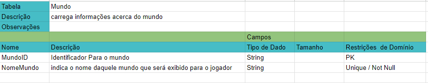
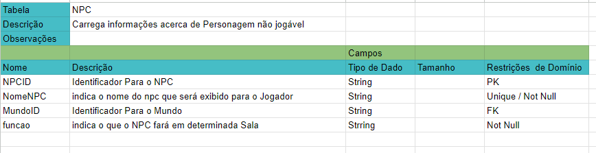
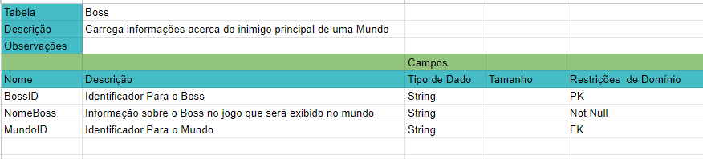
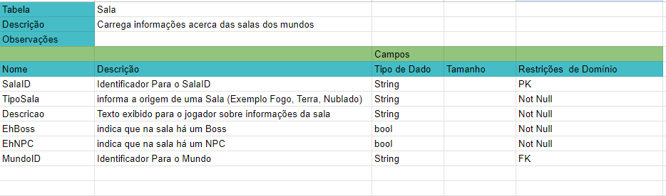
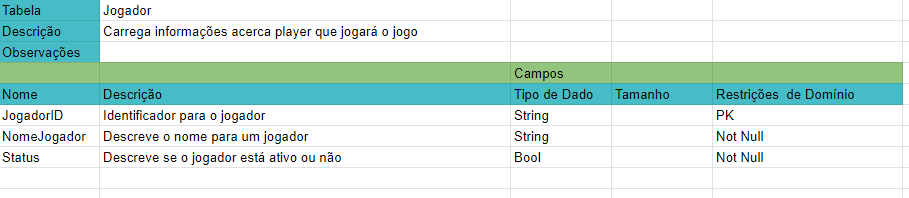
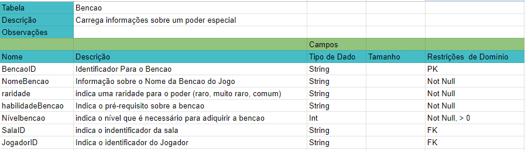
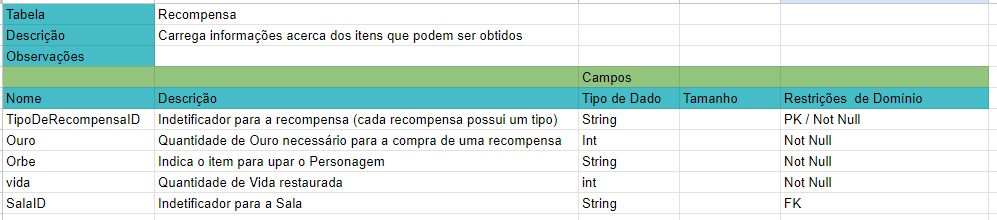
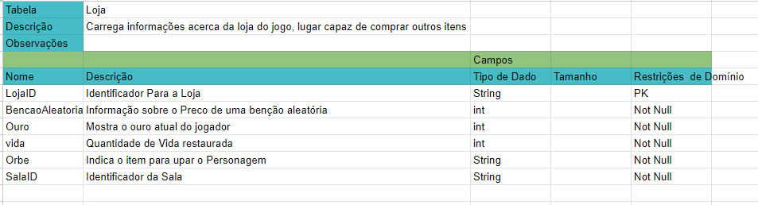
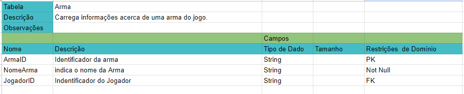
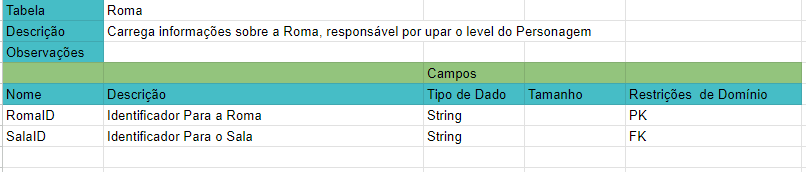

## Introdução

Um dicionário de dados em bancos de dados relacionais é uma coleção de dados que descrevem a estrutura e o conteúdo de um banco de dados. Através dele consigomos identificar Chaves Primárias e Estrangeiras, Nomes de Tabelas e campos, Tipos de Dados, Restrições e Regras, Observações e Descrição de tabelas e campos, tamanho.

O dicionário de dados é essencial para que os desenvolvedores do banco de dados entendam a sua estrutura e possam trabalhar com os dados de forma eficaz e segura. Ele orienta a manipulação e o gerenciamento dos dados no banco de dados relacional, permitindo uma melhor manutenção.

Para a confecção das tabelas foi utilizado a ferramento spreadsheets e o acesso ao dicionario pode ser encontrado em: [Link](https://docs.google.com/spreadsheets/d/1YHAq0cNd358JixKRJPjnu7olGClyv7xFmheFlepW34Q/edit?usp=sharing) 

## Entidades

A seguir Descrevemos todas Entidade que imaginamos para o jogo Hades.
### Entidade Mundo

 <figcaption>
    <b>Figura 1:
     Entidade Mundo</b>
     <small>Fonte:Propria</small>
</figcaption> 

### Entidade NPC

 <figcaption>
    <b>Figura 2:
     Entidade NPC</b>
     <small>Fonte:Propria</small>
</figcaption> 

### Entidade Boss

 <figcaption>
    <b>Figura 3:
     Entidade Boss</b>
     <small>Fonte:Propria</small>
</figcaption> 

### Entidade Sala

 <figcaption>
    <b>Figura 4:
     Entidade Sala</b>
     <small>Fonte:Propria</small>
</figcaption> 

### Entidade Jogador

 <figcaption>
    <b>Figura 5:
     Entidade Jogador</b>
     <small>Fonte:Propria</small>
</figcaption> 

### Entidade Bencao

 <figcaption>
    <b>Figura 6:
     Entidade Bencao</b>
     <small>Fonte:Propria</small>
</figcaption> 

### Entidade Recompensa

 <figcaption>
    <b>Figura 7:
     Entidade Recompensa</b>
     <small>Fonte:Propria</small>
</figcaption> 

### Entidade Loja

 <figcaption>
    <b>Figura 8:
     Entidade Loja</b>
     <small>Fonte:Propria</small>
</figcaption> 

### Entidade Arma

 <figcaption>
    <b>Figura 9:
     Entidade Arma</b>
     <small>Fonte:Propria</small>
</figcaption> 

### Entidade Roma

 <figcaption>
    <b>Figura 10:
     Entidade Roma</b>
     <small>Fonte:Propria</small>
</figcaption> 

| Data | Versão | Descrição | Autores |
|:------:|:--------:|-----------|-------|
| 02/10/2023 | 1.0 | Criação do dicionário de dados | Francisco Mizael Santos, Guilherme Basílio do Espirito Santo, Joao Lucas Pinto Vasconcelos, Arthur Lima |