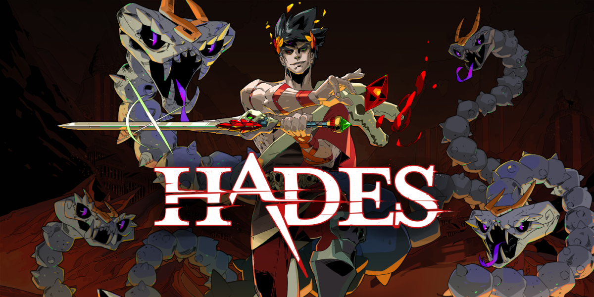

---
hide:
  - navigation
  - toc
---

# **Hades**

## Descrição

O projeto atual é uma iniciativa que busca desenvolver um jogo baseado no renomado universo do jogo Hades. Este empreendimento é uma aplicação direta dos conceitos teóricos adquiridos na disciplina Sistema de Banco de Dados 1, ministrada pela FGA UnB. O objetivo é não apenas replicar a rica mitologia e a jogabilidade cativante que caracterizam Hades, mas também implementar técnicas sofisticadas de gerenciamento de banco de dados para otimizar o desempenho e a experiência do usuário. Este projeto representa um marco significativo em nosso percurso acadêmico, permitindo a integração da teoria e prática de maneira eficaz e impactante.

## Participantes

|                                     Nome                                      | Matrícula |
| :---------------------------------------------------------------------------: | :-------: |
| <a href="https://www.github.com/frmiza">Francisco Mizael Santos da Silva </a> | 180113321 |
|   <a href="github.com/GuilhermeBES">Guilherme Basílio do Espirito Santo</a>   | 160007615 |
|        <a href="github.com/HacKairos">Joao Lucas Pinto Vasconcelos</a>        | 190089601 |
| <a href="https://github.com/Arthurlima544">Arthur josé Nascimento de Lima</a> | 190084600 |

## Executando o Projeto

